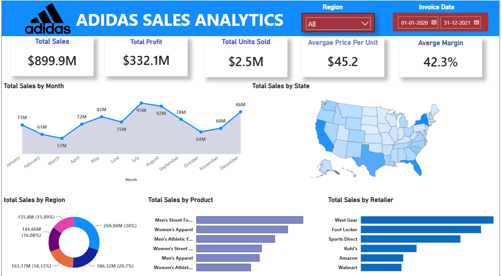
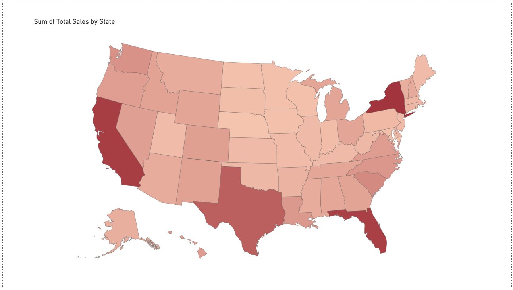
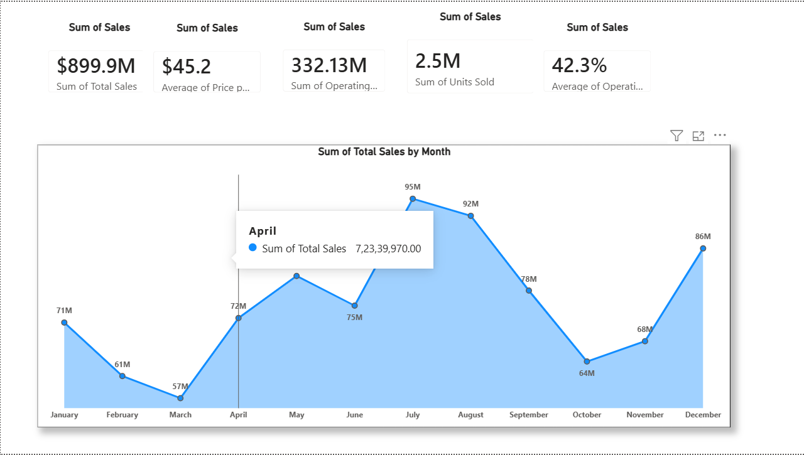

# Adidas Sales Analytics Dashboard

## 📊 Project Overview

An interactive **Power BI sales analytics dashboard** developed to analyze Adidas sales performance across products, retailers, regions, and time periods.

The dashboard transforms raw sales data into interactive business insights using **Power BI, DAX, and data visualization techniques**.

---

## 🎯 Objectives

* Analyze overall Adidas sales and profitability
* Track key business performance indicators
* Identify high-performing products and retailers
* Compare sales performance across regions and states
* Analyze monthly sales trends
* Provide an interactive dashboard for business decision-making

---

## 🛠️ Tools & Technologies

* **Power BI**
* **DAX**
* **Microsoft Excel**
* **Data Cleaning & Transformation**
* **Data Visualization**
* **Business Intelligence**

---

## 📈 Key KPIs

The dashboard provides an overview of:

* **Total Sales:** $899.9M
* **Total Profit:** $332.1M
* **Units Sold:** 2.5M
* **Average Price per Unit:** $45.2
* **Average Profit Margin:** 42.3%

---

## 🔍 Analysis Performed

### Sales Trend Analysis

Analyzed sales performance over time to identify monthly trends and changes in revenue.

### Geographic Analysis

Analyzed sales across different states and regions using map-based visualizations.

### Product Analysis

Compared product categories to identify high-performing and low-performing products.

### Retailer Analysis

Analyzed sales contribution and performance across different retail channels.

### Profitability Analysis

Compared sales, profit, pricing, and margins to understand overall business performance.

---

## 📊 Dashboard Features

* Interactive KPI cards
* Monthly sales trend visualization
* Geographic sales analysis
* Product performance analysis
* Retailer performance analysis
* Region filtering
* Date filtering
* Interactive Power BI visuals
* DAX-based calculated measures

---

## 💡 Key Business Questions

The dashboard was designed to answer questions such as:

* Which products generate the highest sales?
* Which regions contribute the most revenue?
* Which retailers have the strongest performance?
* How do sales change over time?
* Which areas show stronger profitability?
* What are the major contributors to overall sales performance?

---

## 🖥️ Dashboard Preview

### Overview



### Geographic Analysis



### Sales Trend Analysis



### Product & Retailer Analysis


---

## 📁 Project Structure

```text
adidas-sales-analytics-powerbi/
│
├── README.md
│
├── dashboard/
│   └── Adidas_Sales_Analytics.pbix
│
└── screenshots/
    ├── dashboard-overview.png
    ├── geographic-analysis.png
    ├── sales-trend-analysis.png
    └── product-retailer-analysis.png
```

---

## 📌 Skills Demonstrated

**Data Analysis:** Data Cleaning, KPI Analysis, Trend Analysis, Business Analysis

**Power BI:** Dashboard Development, DAX, Interactive Visualizations, Slicers

**Business Intelligence:** Sales Reporting, Geographic Analysis, Product Analysis, Retailer Analysis

---

## 🚀 Outcome

The project demonstrates the ability to transform sales data into an interactive business intelligence solution and communicate key performance indicators and trends through data visualization.
